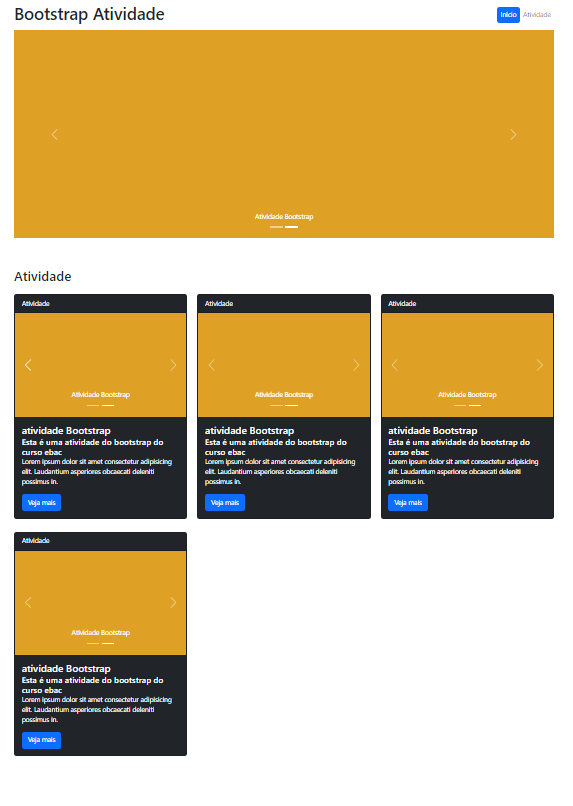

### Bootstrap Atividade

## Requisitos

- Criar um projeto utilizando o Bootstrap;

- Criar uma página que contenha os elementos:

- Carousel de imagens;

- Um layout com grid, onde na visão desktop teremos 3 itens por linha, no tablet 2 itens por linha e no smartphone 1 item por linha;

- Inserir um card dentro das colunas, o conteúdo do card fica a seu critério;

## Sobre
- Coloquei carousel dentro dos cards.
- Usei o jquery para verificar se o botão menu estão aberto em tablets e celulares e caso esteja ao clicar fora o menu é recolhido.
- Também utilizei a espionagem de rolagem do scroll para dar o feedback ao cliente em tempo real em qual sessão ele está, assim vai atualizando no cabeçalho. -> inicio -> atividade.
- Página está com grid para PC, Tablet & Celular.

##

Clique para ver 👇

    <a href="https://ebac-modulo-bootstrap-avancado-atividade.vercel.app/">
        </img>
    </a>

